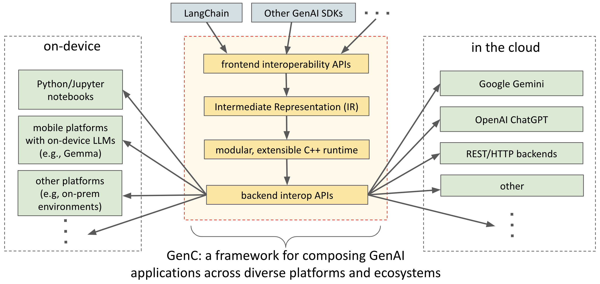

# GenC

**GenC** is an open-source framework for building GenAI-powered applications.

The central problem GenC aims to solve is the fragmentation of the GenAI
ecosystem. Many capabilities useful to GenAI developers evolve independently in
siloed domains, and do not easily compose or interoperate with one-another.

For example, LangChain/Python/Jupyter is popular as a platform of choice for
modeling GenAI logic in many domains, particularly when prototyping, but e.g.,
mobile apps are commonly written in Java or Kotlin, and the two worlds don't
mix easily. Developers must choose between the rich high-level APIs and ease
and speed of prototyping offered by the former vs. an easy path to mobile
deployment or access to latest on-device LLM APIs offered by the latter.

GenC is a glue framework that enables developers to compose capabilities across
these and other domains. Our target audience is any GenAI developers,
especially those seeking benefits such as composability, portability, and deep
customizability (see the [summary of benefits](genc/docs/benefits.md)).

For example, here's how you can use GenC to author a simple chain powered by a
device-to-Cloud model cascade in LangChain/Python/Jupyter:

```
import genc
import langchain

my_app_logic = genc.python.interop.langchain.create_computation(
    langchain.chains.LLMChain(
        llm=genc.python.interop.langchain.ModelCascade(models=[
            genc.python.interop.langchain.CustomModel(uri="/cloud/gemini"),
            genc.python.interop.langchain.CustomModel(uri="/device/gemma")]),
        prompt=langchain.prompts.PromptTemplate(
            input_variables=["topic"], template="Tell me about {topic}.")))
```

The result is a platform and language-independent
**Intermediate Representation** (IR) that can be loaded and executed as follows
(see a complete step-by-step walkthrough and deployment instructions in
[Tutorial 1](genc/docs/tutorials/tutorial_1_simple_cascade.ipynb)):

```
myAppLogic = ... // load the application logic, e.g., from a file or asset
myRuntime = new DefaultExecutor(...);
javaCallable = Runner.create(myAppLogic, myRuntime.getExecutorHandle());

... = javaCallable.call("scuba diving");
```

The example illustrates several dimensions of composability and portability
offered by GenC:

*   **Across programming languages**. We offer authoring and runtime APIs in
    C++, Python, and Java. You can author logic in any of the languages, merge
    it with logic authored in another language, and load it for execution in
    yet another. We anticipate extending support to JavaScript, and potentially
    other languages in the future.

*   **Across frontend SDKs and deployment backends**. In the example above,
    logic was authored using LangChain APIs, but the resulting representation
    (IR) is no longer coupled to LangChain - it's executed by a lightweight C++
    runtime (in this case, embedded in a Java app). This C++ runtime
    can be hosted on edge devices or in Cloud services. In general, code
    executed at runtime has no dependency on SDKs used at the authoring time.

    The included demo runs against Gemma on-device models (via LLamaCPP) and
    Gemini cloud models offered by Vertex AI, but it can be easily re-configured
    to utilize any other LLMs (see [other supported models](genc/docs/models.md)),
    as well as your own preferred libraries, network services, etc.

    GenC also allows you to author different parts of your GenAI logic in
    multiple SDKs, and merge the resulting IR into a single executable
    structure.

*   **Across prototyping and production platforms**. In
    [Tutorial 1](genc/docs/tutorials/tutorial_1_simple_cascade.ipynb), we show you
    how you can run the example code above locally in a Colab notebook, then
    deploy it unchanged in a Java client (which may represent, e.g., a mobile
    app). This kind of seamless portability enables you to quickly iterate
    and test your code in a target environment during development, improving
    your development velocity and streamlining the path to deployment.

    The portability offered by GenC lets you run the same code across multiple
    types of cloud and mobile platforms, which can save you time when targeting
    multiple product surfaces.

*   **Across devices and cloud**. The example above is powered by a cascade
    of two models, one running locally on the client (e.g., on-device), and one
    running in Cloud. GenC lets you mix and match on-device and cloud
    components, as well as to dynamically dispatch any executable logic
    expressed in GenC across multiple executable environments.

GenC shares common goals with platforms such as LangChain, in that we aim to
provide modular, customizable development surfaces to maximize developer
velocity; albeit GenC aims to go further, extending compositionality benefits
across ecosystems and frameworks.

GenC's relationship to platforms like LangChain is synergistic, characterized
by layering, as shown in the diagram below. Our overarching goal is to take
advantage of all capabilities that already exist, and bring them together for
use by GenAI developers.



If you're intrigued, please review the
[summary of GenC's benefits](genc/docs/benefits.md), or dive straight into the
tutorials and documentation to experience what GenC has to offer:

*   [Tutorials](genc/docs/tutorials/README.md) show diverse
    examples of usage to showcase some of GenC's capabilities.

*   [Architecture](genc/docs/architecture.md) covers the system overview and key
    concepts in GenC.

*   [API documentation](genc/docs/api.md) covers the developer
    and extensibility surfaces.

*   [Model documentation](genc/docs/models.md) lists the supported models.

*   [IR](genc/docs/ir.md) and [runtime](genc/docs/runtime.md) cover more advanced
    topics for a deeper level of customization.

*   [Setup](SETUP.md) instructions explain how to setup a full development
    and runtime environment that you can use to build GenC, run and customize
    the included examples (at this time, we only support building from source
    in GitHub; additional support for things like PIP releases, pre-built
    images, etc., will be included in the future).

*   [Contributing](CONTRIBUTING.md) instructions explain where and how you can
    contribute to the platform. GenC is designed to be extensible, and we'd
    like to grow it, with your help, to support your preferred domain and the
    kinds of services and capabilities you need. We welcome your contributions!

**At this stage, GenC is intended for experimental and research use only**, and
at the "beta" stage of development. You can expect the APIs and capabilities to
evolve, in part based on demand and feedback from the community.

Use [GitHub issues](https://github.com/google/genc/issues) for
tracking requests and bugs.

Please direct questions to [Stack Overflow](https://stackoverflow.com) using the
[genc](https://stackoverflow.com/questions/tagged/genc) tag.
